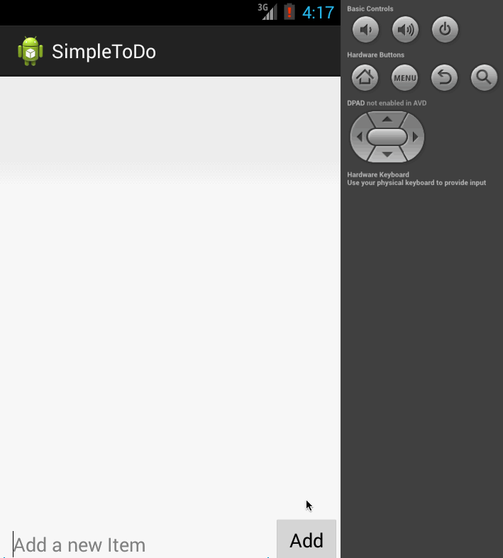

#### Application : SimpleToDo 
-----

    (Pre-WorK) 
     -- Setup your Android environment
     -- Build initial todo app
     -- Submit todo app for review via Github

    This is a sample app which demonstrates a list view of items. User can do following operations :
    --  Add : Item can be added by entering inputs in text box and then click Add button. Following are the validations added for Add operation  
          -- Preventing from adding item with blank name 
          -- Preventing from adding duplicated items
          -- Items with same name (of already existing item) but with spaces (in the begining / end) is considered as duplicated it
    --  Delete : Item can be removed on long press on item.  
          -- After deleting last item, information message is displayed to user
    --  Data in listview is persistant. Previous data will be avialble on next relaunch  
    --  Available only in En-US   
  

Walkthrough of app :
  

GIF created with [LiceCap](http://www.cockos.com/licecap/).
